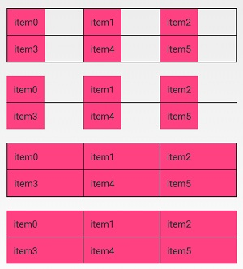
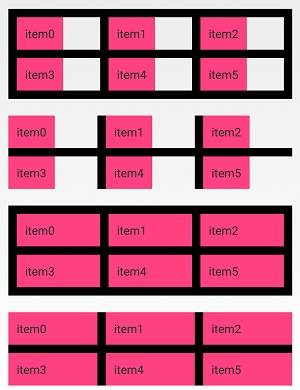
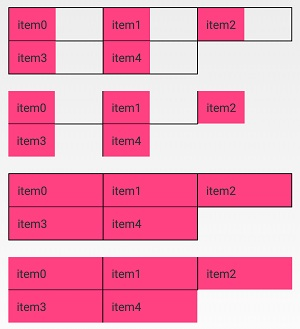
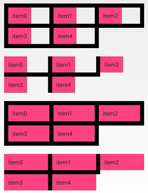
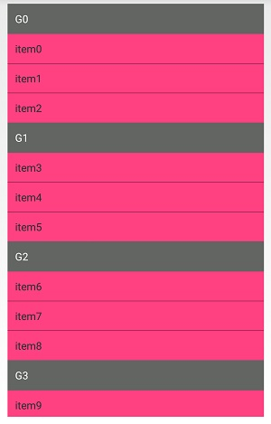

# LibDecoration
用于RecyclerView的分割线类库

##引用

```
	allprojects {
		repositories {
			...
			maven { url 'https://jitpack.io' }
		}
	}
```
```
	dependencies {
	        implementation 'com.github.q1113225201:ItemDecoration:1.0.0'
	}
```

## 网格分割线——[GridItemDecoration](libdecoration/src/main/java/com/sjl/libdecoration/GridItemDecoration.java)

满格




不满格




## 分组分割线——[GroupItemDecoration](libdecoration/src/main/java/com/sjl/libdecoration/GroupItemDecoration.java)




